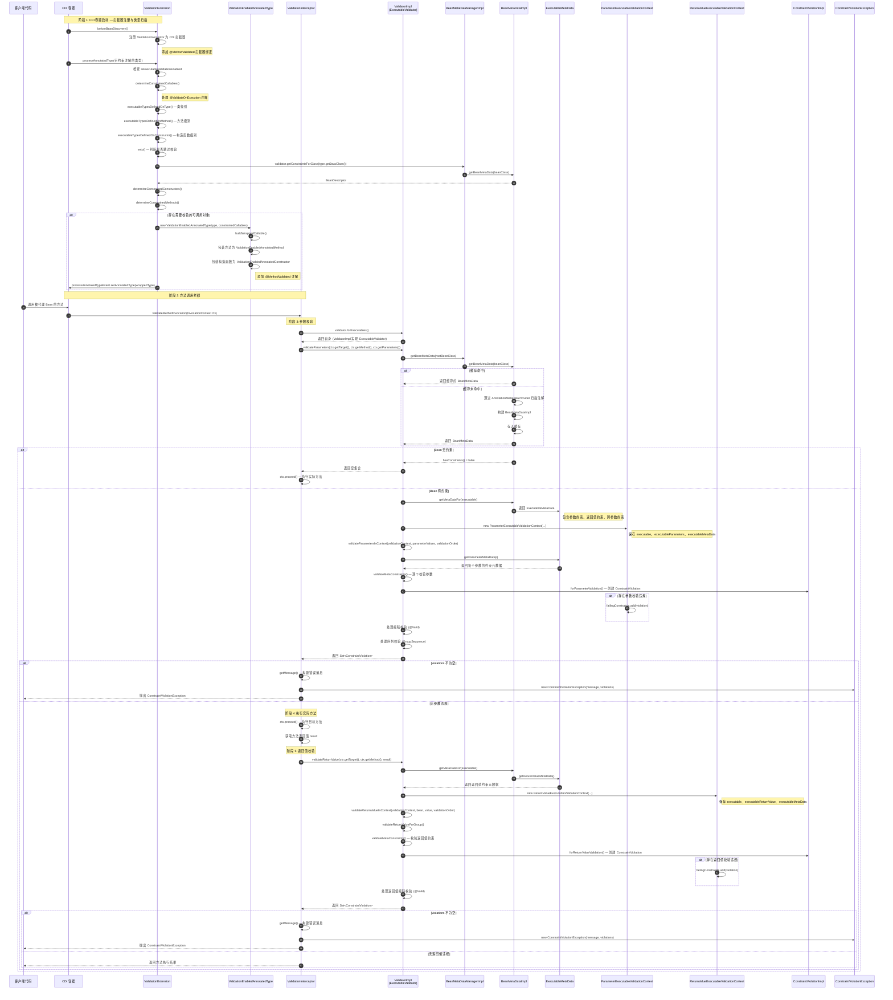

# Hibernate Validator CDI 方法校验拦截器完整实现流程分析

## 一、概述

Hibernate Validator 的 CDI 集成模块通过 CDI 拦截器机制实现了 Bean Validation 规范中定义的方法级校验功能。整个流程从 CDI 容器启动时扫描带有约束注解的类型开始，到拦截器执行校验并抛出 `ConstraintViolationException` 结束。

---

## 二、关键类及其作用

### 2.1 CDI 模块 (`cdi/src/main/java/`)

| 类名 | 作用 |
|------|------|
| `ValidationExtension` | CDI Portable Extension，负责注册 Validator/ValidatorFactory Bean，并在 Bean 发现阶段识别需要校验的可调用对象 |
| `ValidationInterceptor` | 核心拦截器，使用 `@AroundInvoke` 和 `@AroundConstruct` 拦截方法和构造函数调用，执行参数和返回值校验 |
| `MethodValidated` | 拦截器绑定注解（`@InterceptorBinding`），标记需要方法校验的类型或方法 |
| `ValidationEnabledAnnotatedType` | 包装原始 `AnnotatedType`，将需要校验的构造函数和方法替换为带 `@MethodValidated` 注解的版本 |
| `ValidationEnabledAnnotatedCallable` | 抽象基类，为被包装的可调用对象添加 `@MethodValidated` 注解 |
| `ValidationEnabledAnnotatedMethod` | 包装 `AnnotatedMethod`，使其返回 `@MethodValidated` 注解 |
| `ValidationEnabledAnnotatedConstructor` | 包装 `AnnotatedConstructor`，使其返回 `@MethodValidated` 注解 |

### 2.2 Engine 模块 (`engine/src/main/java/`)

| 类名 | 作用 |
|------|------|
| `ValidatorImpl` | `Validator` 接口的核心实现，实现 `ExecutableValidator` 接口，提供 `validateParameters`、`validateReturnValue` 等方法 |
| `BeanMetaDataManager` / `BeanMetaDataManagerImpl` | 管理 Bean 的约束元数据缓存，提供 `BeanMetaData` 的检索 |
| `BeanMetaData` / `BeanMetaDataImpl` | 封装 Bean 的所有约束元数据，包括属性、方法、构造函数的约束信息 |
| `ExecutableMetaData` | 封装方法/构造函数的约束元数据，包括参数约束、返回值约束、跨参数约束 |
| `ParameterExecutableValidationContext` | 参数校验的验证上下文，保存待校验参数和元数据 |
| `ReturnValueExecutableValidationContext` | 返回值校验的验证上下文，保存待校验返回值和元数据 |
| `ValidationContextBuilder` | 构建验证上下文的工厂类 |
| `ConstraintViolationImpl` | `ConstraintViolation` 的实现类，封装校验违规信息 |

---

## 三、完整调用流程详解

### 阶段 1：CDI 容器启动 — 拦截器注册与类型扫描

#### 1.1 拦截器注册

`ValidationExtension.beforeBeanDiscovery()` 方法在 CDI 容器启动前被调用：

```java
public void beforeBeanDiscovery(@Observes BeforeBeanDiscovery beforeBeanDiscoveryEvent,
        final BeanManager beanManager) {
    // 注册 ValidationInterceptor 为 CDI 拦截器
    AnnotatedType<ValidationInterceptor> annotatedType = 
        beanManager.createAnnotatedType(ValidationInterceptor.class);
    beforeBeanDiscoveryEvent.addAnnotatedType(annotatedType, ValidationInterceptor.class.getName());
}
```

#### 1.2 约束类型扫描

`ValidationExtension.processAnnotatedType()` 监听每个带有约束注解的类型：

```java
public <T> void processAnnotatedType(@Observes @WithAnnotations({
        Constraint.class,
        Valid.class,
        ValidateOnExecution.class
}) ProcessAnnotatedType<T> processAnnotatedTypeEvent)
```

**关键步骤：**

1. 检查全局校验是否启用（`isExecutableValidationEnabled`）
2. 调用 `determineConstrainedCallables()` 识别需要校验的方法和构造函数
3. 如果存在需要校验的可调用对象，用 `ValidationEnabledAnnotatedType` 包装原始类型

#### 1.3 `@ValidateOnExecution` 注解处理

`determineConstrainedCallables()` 方法处理 `@ValidateOnExecution` 注解：

- **类级别**：`executableTypesDefinedOnType()` 读取类上的 `@ValidateOnExecution` 注解
- **方法级别**：`executableTypesDefinedOnMethod()` 读取方法上的 `@ValidateOnExecution` 注解
- **构造函数级别**：`executableTypesDefinedOnConstructor()` 读取构造函数上的 `@ValidateOnExecution` 注解

**ExecutableType 枚举值：**
- `IMPLICIT` — 默认行为（构造函数和非 getter 方法）
- `ALL` — 所有可执行对象
- `NONE` — 无
- `CONSTRUCTORS` — 仅构造函数
- `NON_GETTER_METHODS` — 非 getter 方法
- `GETTER_METHODS` — getter 方法

**veto 逻辑：**
```java
private boolean veto(EnumSet<ExecutableType> classLevelExecutableTypes,
        EnumSet<ExecutableType> memberLevelExecutableType,
        ExecutableType currentExecutableType) {
    if (!memberLevelExecutableType.isEmpty()) {
        return !memberLevelExecutableType.contains(currentExecutableType)
                && !memberLevelExecutableType.contains(ExecutableType.IMPLICIT);
    }
    if (!classLevelExecutableTypes.isEmpty()) {
        return !classLevelExecutableTypes.contains(currentExecutableType)
                && !classLevelExecutableTypes.contains(ExecutableType.IMPLICIT);
    }
    return !globalExecutableTypes.contains(currentExecutableType);
}
```

#### 1.4 包装 AnnotatedType

对于需要校验的类型，`ValidationEnabledAnnotatedType` 包装原始类型：

- `ValidationEnabledAnnotatedMethod` 为方法添加 `@MethodValidated` 注解
- `ValidationEnabledAnnotatedConstructor` 为构造函数添加 `@MethodValidated` 注解

这使得 CDI 容器知道哪些方法需要被 `ValidationInterceptor` 拦截。

### 阶段 2：方法调用拦截 — 参数校验

当被标记的方法被调用时，`ValidationInterceptor.validateMethodInvocation()` 执行：

```java
@AroundInvoke
public Object validateMethodInvocation(InvocationContext ctx) throws Exception {
    ExecutableValidator executableValidator = validator.forExecutables();
    
    // 1. 校验方法参数
    Set<ConstraintViolation<Object>> violations = executableValidator.validateParameters(
            ctx.getTarget(),
            ctx.getMethod(),
            ctx.getParameters()
    );

    if (!violations.isEmpty()) {
        throw new ConstraintViolationException(
                getMessage(ctx.getMethod(), ctx.getParameters(), violations),
                violations
        );
    }

    // 2. 执行实际方法调用
    Object result = ctx.proceed();

    // 3. 校验返回值
    violations = executableValidator.validateReturnValue(
            ctx.getTarget(),
            ctx.getMethod(),
            result
    );

    if (!violations.isEmpty()) {
        throw new ConstraintViolationException(
                getMessage(ctx.getMethod(), ctx.getParameters(), violations),
                violations
        );
    }

    return result;
}
```

### 阶段 3：Engine 模块 — 参数校验执行

#### 3.1 `ValidatorImpl.validateParameters()`

```java
public <T> Set<ConstraintViolation<T>> validateParameters(T object, Method method, 
        Object[] parameterValues, Class<?>... groups) {
    return validateParameters(object, (Executable) method, parameterValues, groups);
}

private <T> Set<ConstraintViolation<T>> validateParameters(T object, Executable executable, 
        Object[] parameterValues, Class<?>... groups) {
    // 1. 获取 Bean 元数据
    Class<T> rootBeanClass = (object != null) ? (Class<T>) object.getClass() 
            : (Class<T>) executable.getDeclaringClass();
    BeanMetaData<T> rootBeanMetaData = beanMetaDataManager.getBeanMetaData(rootBeanClass);

    if (!rootBeanMetaData.hasConstraints()) {
        return Collections.emptySet();
    }

    // 2. 创建参数校验上下文
    ExecutableValidationContext<T> validationContext = getValidationContextBuilder()
            .forValidateParameters(rootBeanClass, rootBeanMetaData, object, executable, parameterValues);

    // 3. 确定校验组顺序
    ValidationOrder validationOrder = determineGroupValidationOrder(groups);

    // 4. 在校验上下文中执行参数校验
    validateParametersInContext(validationContext, parameterValues, validationOrder);

    return validationContext.getFailingConstraints();
}
```

#### 3.2 元数据获取

`BeanMetaDataManager.getBeanMetaData()` 获取 Bean 的完整约束元数据：

1. 检查缓存中是否存在
2. 如果不存在，通过 `AnnotationMetaDataProvider` 从注解中提取元数据
3. 构建 `BeanMetaDataImpl` 并缓存

`BeanMetaData.getMetaDataFor(Executable)` 获取特定方法的元数据：

```java
Optional<ExecutableMetaData> getMetaDataFor(Executable executable)
```

`ExecutableMetaData` 包含：
- `parameterMetaDataList` — 每个参数的约束元数据
- `validatableParametersMetaData` — 可校验参数的聚合元数据
- `crossParameterConstraints` — 跨参数约束
- `returnValueMetaData` — 返回值约束元数据
- `cascadingMetaData` — 级联校验元数据

#### 3.3 参数校验执行

`validateParametersInContext()` 方法：

```java
private <T> void validateParametersInContext(ExecutableValidationContext<T> validationContext,
        Object[] parameterValues, ValidationOrder validationOrder) {
    
    Optional<ExecutableMetaData> executableMetaDataOptional = validationContext.getExecutableMetaData();
    
    if (!executableMetaDataOptional.isPresent()) {
        return; // 方法无约束
    }

    ExecutableMetaData executableMetaData = executableMetaDataOptional.get();

    // 验证参数数量
    if (parameterValues.length != executableMetaData.getParameterTypes().length) {
        throw LOG.getInvalidParameterCountForExecutableException(...);
    }

    // 按校验组迭代执行校验
    Iterator<Group> groupIterator = validationOrder.getGroupIterator();
    while (groupIterator.hasNext()) {
        validateParametersForGroup(validationContext, executableMetaData, parameterValues, groupIterator.next());
        if (shouldFailFast(validationContext)) {
            return;
        }
    }

    // 处理级联校验
    // 处理序列校验
}
```

`validateParametersForSingleGroup()` 执行实际校验：

```java
private <T> void validateParametersForSingleGroup(ExecutableValidationContext<T> validationContext, 
        Object[] parameterValues, ExecutableMetaData executableMetaData, Class<?> currentValidatedGroup) {
    
    // 1. 校验跨参数约束
    if (!executableMetaData.getCrossParameterConstraints().isEmpty()) {
        ValueContext<T, Object> valueContext = getExecutableValueContext(...);
        validateMetaConstraints(validationContext, valueContext, parameterValues, 
                executableMetaData.getCrossParameterConstraints());
    }

    // 2. 逐个校验参数
    ValueContext<T, Object> valueContext = getExecutableValueContext(...);
    for (int i = 0; i < parameterValues.length; i++) {
        ParameterMetaData parameterMetaData = executableMetaData.getParameterMetaData(i);
        Object value = parameterValues[i];
        // 执行约束校验
        validateMetaConstraints(validationContext, valueContext, value, parameterMetaData);
    }
}
```

### 阶段 4：返回值校验

方法执行完成后，`validateReturnValue()` 被调用：

```java
public <T> Set<ConstraintViolation<T>> validateReturnValue(T object, Method method, 
        Object returnValue, Class<?>... groups) {
    return validateReturnValue(object, (Executable) method, returnValue, groups);
}

private <T> Set<ConstraintViolation<T>> validateReturnValue(T object, Executable executable, 
        Object returnValue, Class<?>... groups) {
    // 1. 获取 Bean 元数据
    BeanMetaData<T> rootBeanMetaData = beanMetaDataManager.getBeanMetaData(rootBeanClass);

    // 2. 创建返回值校验上下文
    ExecutableValidationContext<T> validationContext = getValidationContextBuilder()
            .forValidateReturnValue(rootBeanClass, rootBeanMetaData, object, executable, returnValue);

    // 3. 执行返回值校验
    validateReturnValueInContext(validationContext, object, returnValue, validationOrder);

    return validationContext.getFailingConstraints();
}
```

`validateReturnValueInContext()` 处理返回值约束和级联校验。

### 阶段 5：校验结果转换为 ConstraintViolationException

当校验发现违规时，`ValidationInterceptor` 创建并抛出异常：

```java
if (!violations.isEmpty()) {
    throw new ConstraintViolationException(
            getMessage(ctx.getMethod(), ctx.getParameters(), violations),
            violations
    );
}
```

`getMessage()` 方法构建详细的错误信息：

```java
private String getMessage(Member member, Object[] args, Set<? extends ConstraintViolation<?>> violations) {
    StringBuilder message = new StringBuilder();
    message.append(violations.size());
    message.append(" constraint violation(s) occurred during method validation.");
    message.append("\nConstructor or Method: ");
    message.append(member);
    message.append("\nArgument values: ");
    message.append(Arrays.toString(args));
    message.append("\nConstraint violations: ");

    int i = 1;
    for (ConstraintViolation<?> constraintViolation : violations) {
        Path.Node leafNode = getLeafNode(constraintViolation);

        message.append("\n (" + i + ")");
        message.append(" Kind: " + leafNode.getKind());
        if (leafNode.getKind() == ElementKind.PARAMETER) {
            message.append("\n parameter index: " + 
                    leafNode.as(Path.ParameterNode.class).getParameterIndex());
        }
        message.append("\n message: " + constraintViolation.getMessage());
        message.append("\n root bean: " + constraintViolation.getRootBean());
        message.append("\n property path: " + constraintViolation.getPropertyPath());
        message.append("\n constraint: " + constraintViolation.getConstraintDescriptor().getAnnotation());
        i++;
    }
    return message.toString();
}
```

---

## 四、拦截器如何获取方法参数和返回值的约束元数据

### 4.1 元数据获取路径

```
ValidationInterceptor.validateMethodInvocation()
    └── validator.forExecutables() → 返回 ValidatorImpl（实现 ExecutableValidator）
        └── validator.validateParameters(target, method, parameters)
            └── beanMetaDataManager.getBeanMetaData(beanClass)
                └── BeanMetaDataImpl（缓存或创建）
                    └── beanMetaData.getMetaDataFor(executable)
                        └── ExecutableMetaData
                            ├── parameterMetaDataList — 参数约束元数据
                            ├── crossParameterConstraints — 跨参数约束
                            └── returnValueMetaData — 返回值约束元数据
```

### 4.2 元数据来源

1. **注解扫描**：`AnnotationMetaDataProvider` 扫描类、方法、参数上的约束注解
2. **XML 配置**：`XmlMetaDataProvider` 解析 `META-INF/validation.xml`
3. **编程式配置**：通过 `ConstraintMappingContributor` 添加

### 4.3 ExecutableMetaData 结构

```
ExecutableMetaData
├── beanClass — 声明类
├── name — 方法/构造函数名称
├── parameterTypes — 参数类型数组
├── parameterMetaDataList — 每个参数的元数据
│   └── ParameterMetaData
│       ├── type — 参数类型
│       ├── constraints — 约束列表（@NotNull, @Size 等）
│       └── cascadingMetaData — 级联校验元数据（@Valid）
├── crossParameterConstraints — 跨参数约束（@ScriptAssert 等）
├── returnValueMetaData — 返回值元数据
│   ├── type — 返回值类型
│   ├── constraints — 返回值约束
│   └── cascadingMetaData — 返回值级联校验
└── kind — ElementKind（METHOD 或 CONSTRUCTOR）
```

---

## 五、校验结果转换为 ConstraintViolationException 的完整流程

### 5.1 约束违规创建

在 `AbstractValidationContext.createConstraintViolation()` 中：

```java
protected ConstraintViolation<T> createConstraintViolation(
        String messageTemplate, String interpolatedMessage, Path propertyPath, 
        ConstraintDescriptor<?> constraintDescriptor, ValueContext<?, ?> valueContext,
        ConstraintViolationCreationContext constraintViolationCreationContext) {
    return ConstraintViolationImpl.forParameterValidation(
            messageTemplate,
            constraintViolationCreationContext.getMessageParameters(),
            constraintViolationCreationContext.getExpressionVariables(),
            interpolatedMessage,
            getRootBeanClass(),
            getRootBean(),
            valueContext.getCurrentBean(),
            valueContext.getCurrentValidatedValue(),
            propertyPath,
            constraintDescriptor,
            executableParameters,
            constraintViolationCreationContext.getDynamicPayload()
    );
}
```

### 5.2 违规信息收集

`AbstractValidationContext` 维护一个 `failingConstraints` 集合：

```java
private final Set<ConstraintViolation<T>> failingConstraints = new HashSet<>();

public Set<ConstraintViolation<T>> getFailingConstraints() {
    return failingConstraints;
}
```

### 5.3 异常抛出

`ValidationInterceptor` 检查违规集合：

```java
Set<ConstraintViolation<Object>> violations = executableValidator.validateParameters(...);

if (!violations.isEmpty()) {
    throw new ConstraintViolationException(
            getMessage(ctx.getMethod(), ctx.getParameters(), violations),
            violations
    );
}
```

---

## 六、Mermaid 时序图



---

## 七、总结

### 7.1 核心流程总结

1. **启动阶段**：`ValidationExtension` 在 CDI 容器启动时注册拦截器，并扫描带有约束注解的类型，通过 `@ValidateOnExecution` 注解决定哪些方法需要校验
2. **包装阶段**：需要校验的方法被包装为 `ValidationEnabledAnnotatedMethod`，添加 `@MethodValidated` 拦截器绑定注解
3. **拦截阶段**：`ValidationInterceptor` 拦截方法调用，先校验参数，再执行方法，最后校验返回值
4. **元数据获取**：通过 `BeanMetaDataManager` 获取 Bean 的约束元数据，`ExecutableMetaData` 提供方法和参数的约束信息
5. **校验执行**：`ValidatorImpl` 按校验组顺序执行参数和返回值校验，创建 `ConstraintViolation` 对象
6. **异常抛出**：如果存在违规，`ValidationInterceptor` 构建详细错误消息并抛出 `ConstraintViolationException`

### 7.2 关键设计模式

- **装饰器模式**：`ValidationEnabledAnnotatedType` 装饰原始 `AnnotatedType`
- **拦截器模式**：CDI 拦截器实现 AOP 校验
- **工厂模式**：`ValidationContextBuilder` 创建验证上下文
- **缓存模式**：`BeanMetaDataManager` 缓存 Bean 元数据以提高性能
